# spring-gumball

### This example demonstrates the following two GitHub Workflows.

* https://help.github.com/actions/language-and-framework-guides/building-and-testing-java-with-gradle

* https://github.com/google-github-actions/setup-gcloud/tree/master/example-workflows/gke

### Build Dependencies

* Gradle 5.6
* JDK 11

<h2>CI Workflow</h2>

main.yml in ./github/workflows:
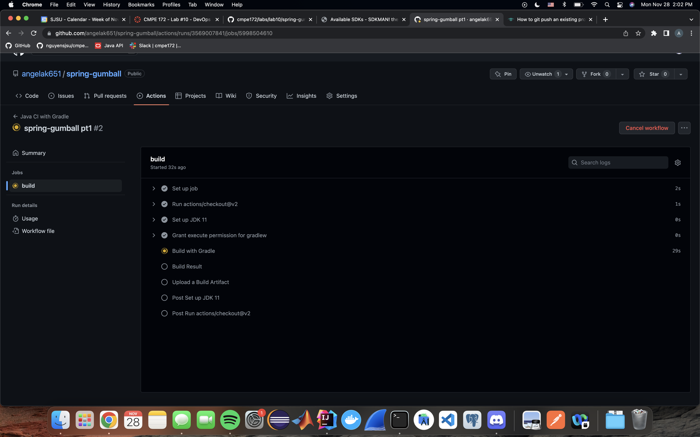

After committing to main branch:
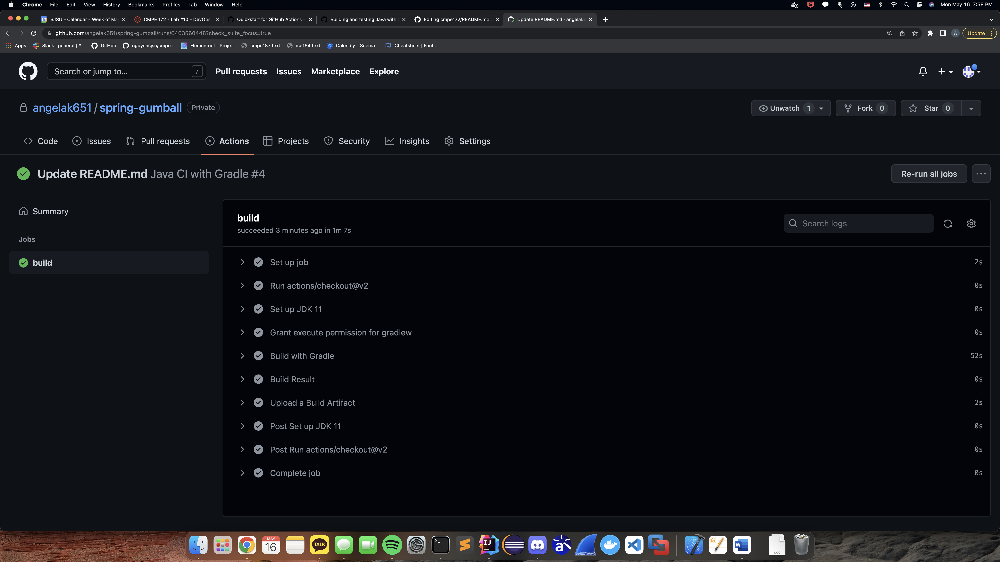

<h2>CD Workflow</h2>

Create GKE service account with secret key:
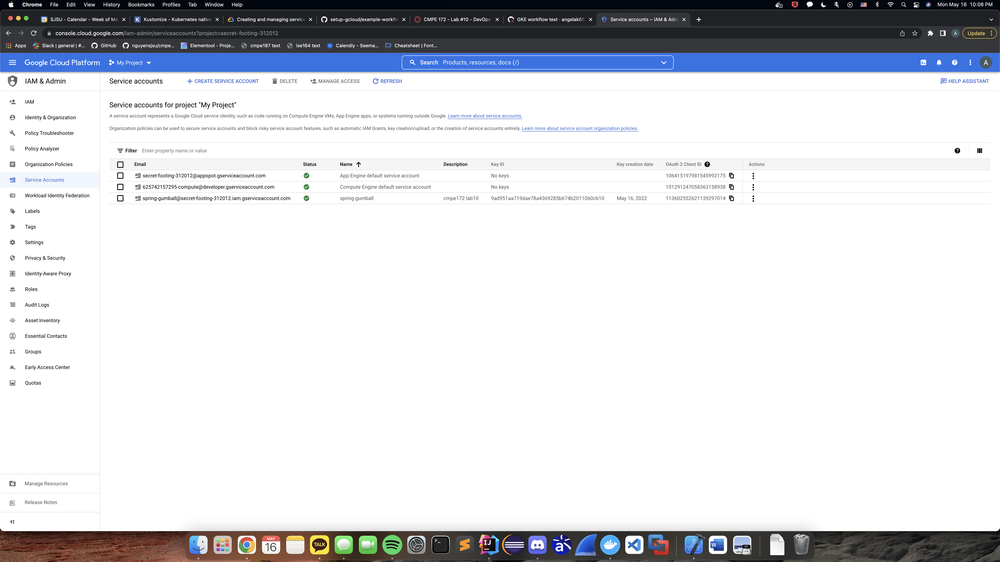
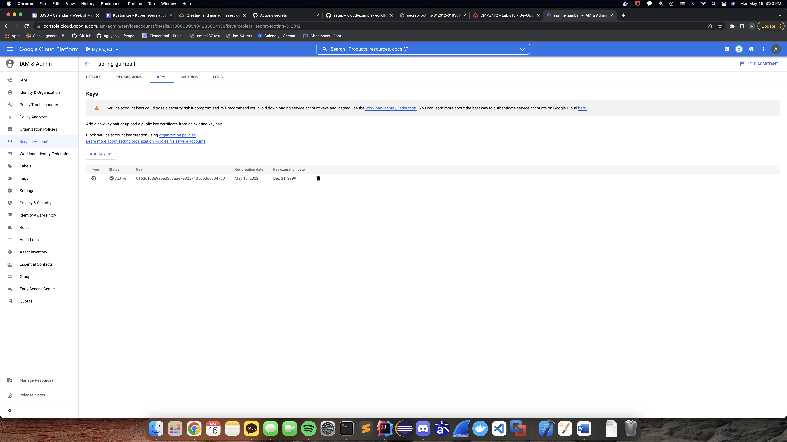

Add project ID and key to Action Secret:
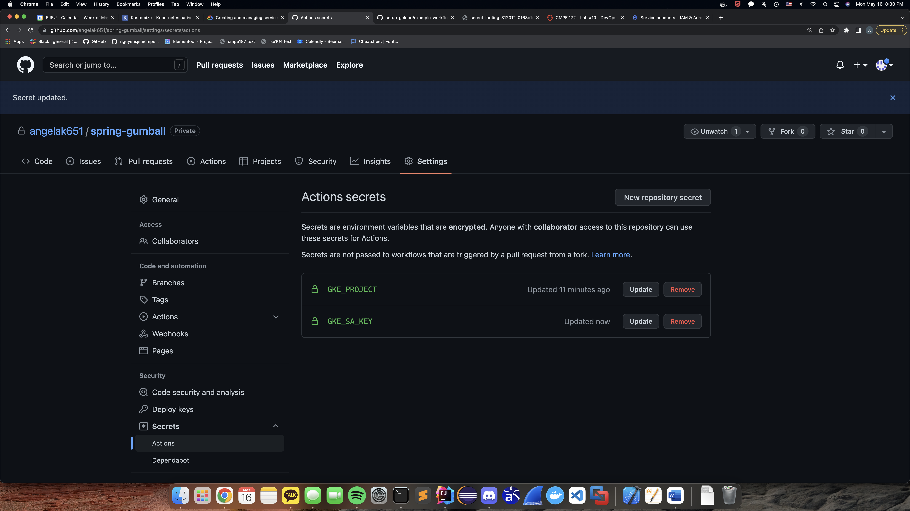

Ran into errors because of incorrect permissions in GKE:
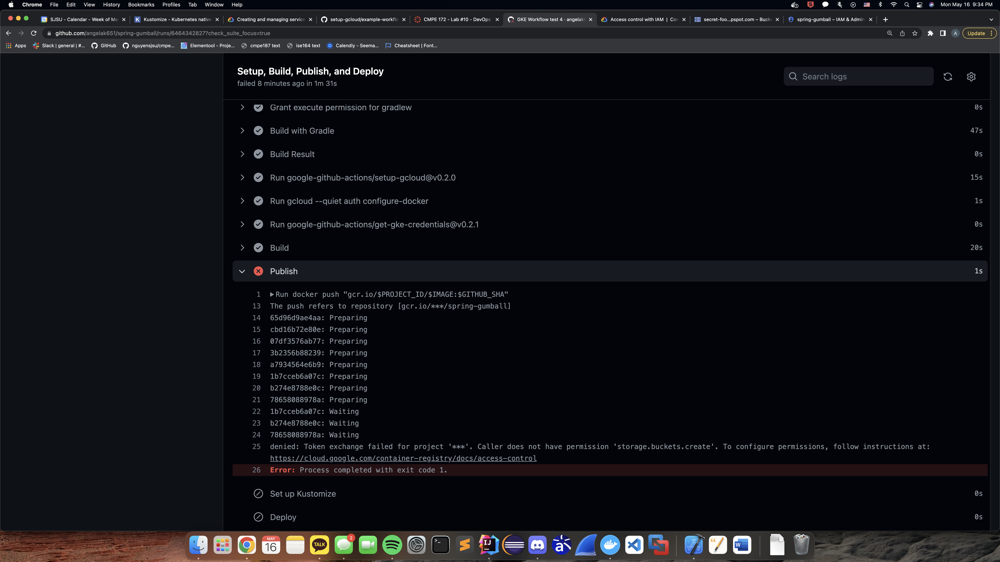

Configuring proper permissions:
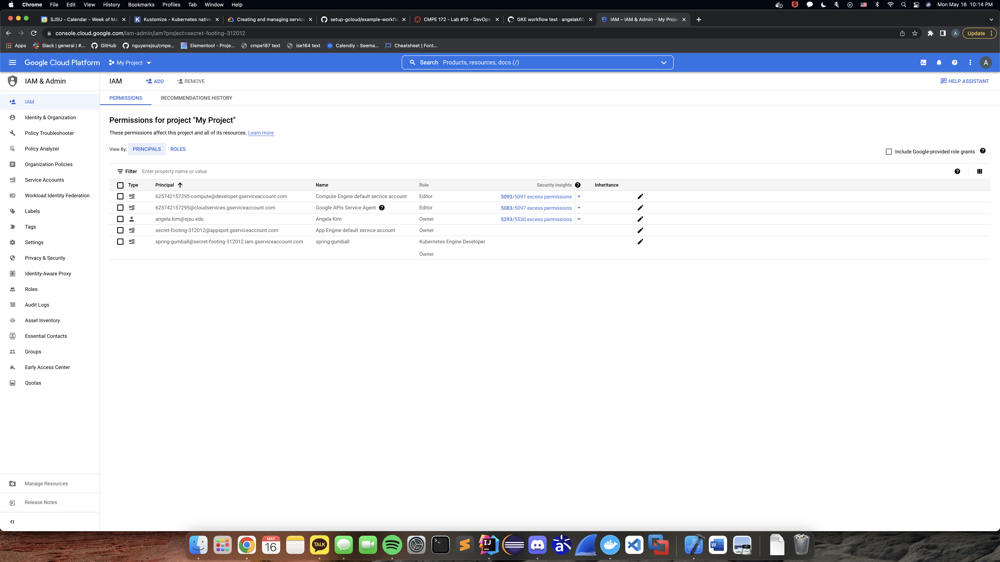

After creating a release:
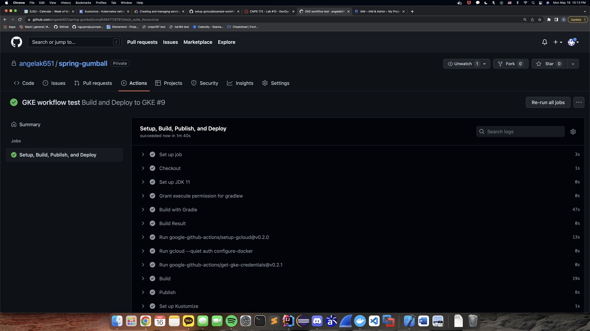

Project deployed on GCP:
Cluster -
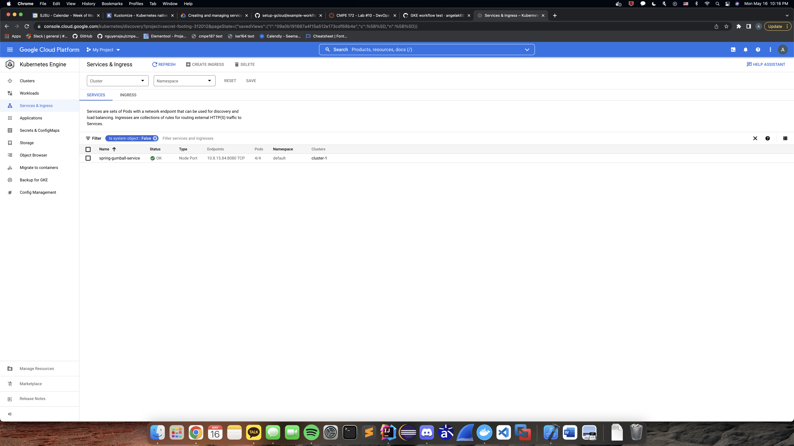

Workload - 
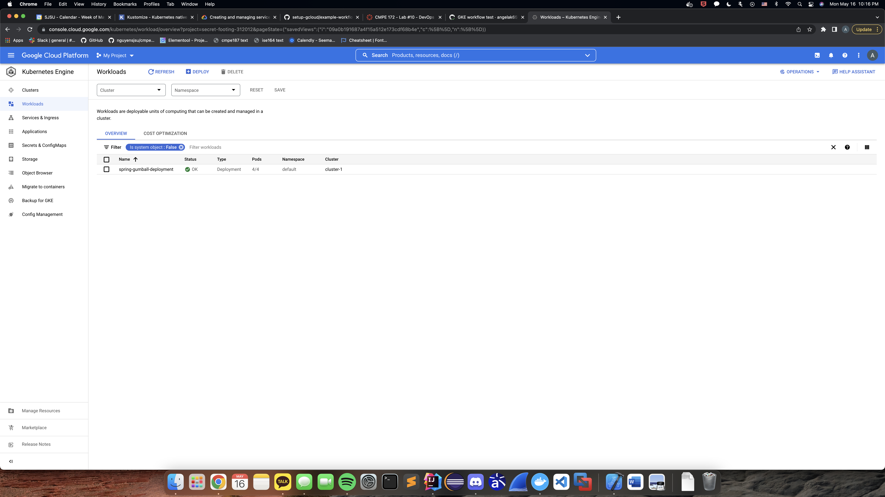

Service - 

Ingress - 
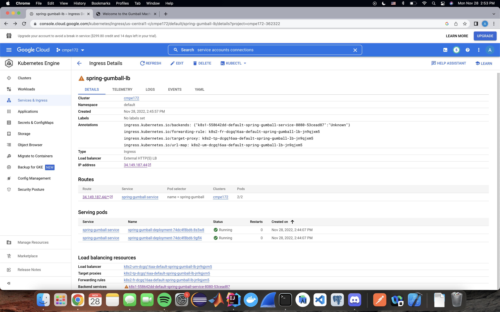

Gumball running on endpoint:
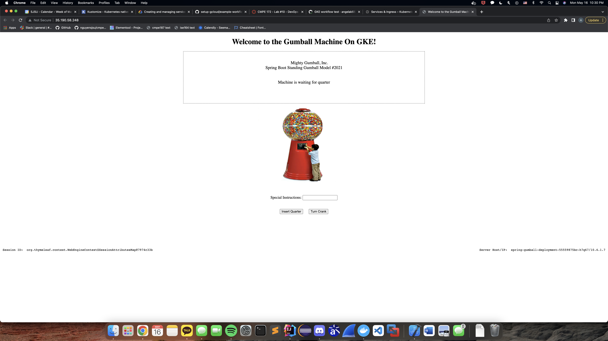

