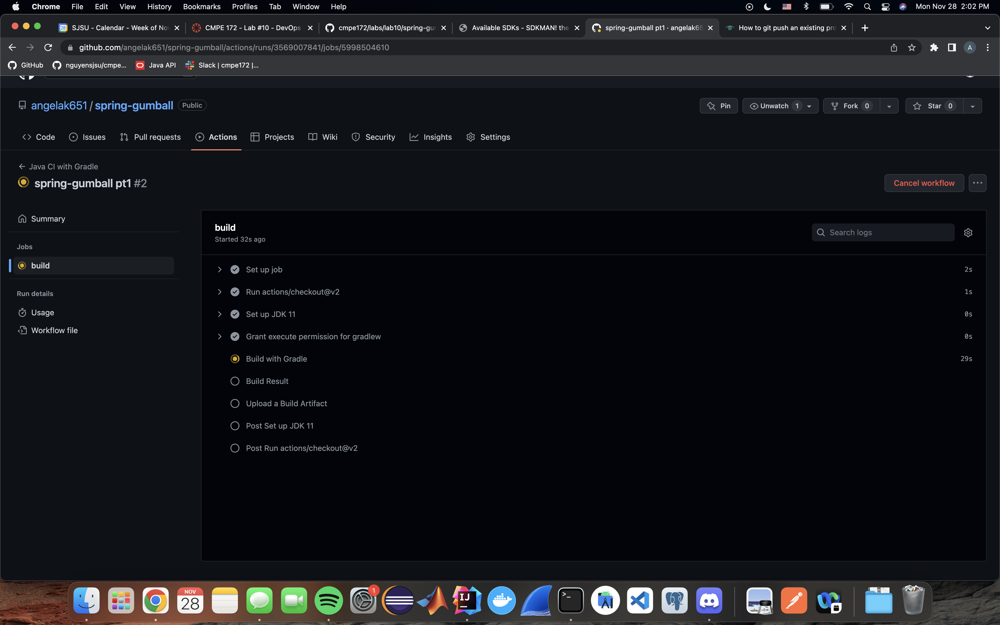

# spring-gumball

### This example demonstrates the following two GitHub Workflows.

* https://help.github.com/actions/language-and-framework-guides/building-and-testing-java-with-gradle

* https://github.com/google-github-actions/setup-gcloud/tree/master/example-workflows/gke

### Build Dependencies

* Gradle 5.6
* JDK 11

<h2>CI Workflow</h2>

main.yml in ./github/workflows:

After committing to main branch:

<h2>CD Workflow</h2>

Create IAM account with roles Kubernetes Engine Developer and Storage Admin:

Create service account and secret key:

Github secrets:

Github release:

Github actions:

GKE deployment:

GKE service:

GKE ingress:

Spring Gumball:

